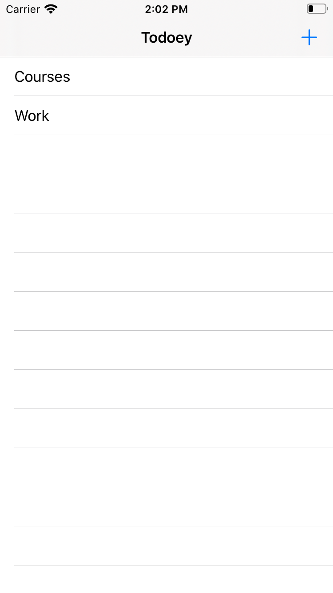
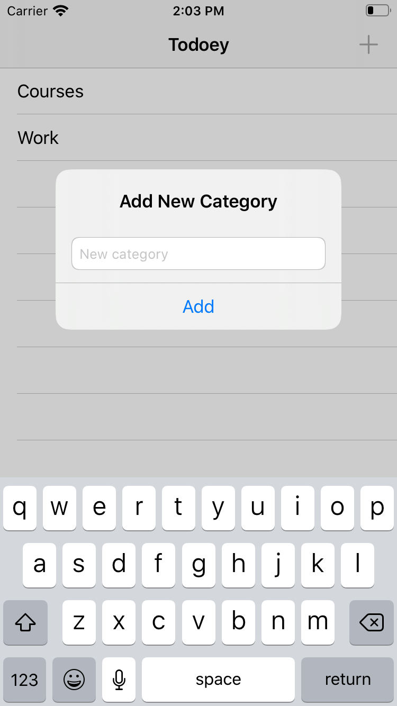

#  Todoey-CoreData
A Todo list application with sublist functionality using CoreData.

 This application is part of <a href="https://www.udemy.com/course/ios-13-app-development-bootcamp/">iOS Application Bootcamp</a> course by Dr. Angela Yu, <a href="https://www.appbrewery.co">TheAppBrewery</a>.

## Screenshots
   

## Technologies
- Swift Programming Language
- Storyboard
- UIKit 
    - Navigation Controller | UIBarButtonItem
    - UITableViewController
    - UISearchBar | UISearchBarDelegate
    - UIAlertController | UIAlertAction | UITextField 
- Core Data - NSManagedObjectContext | NSFetchRequest<NSFetchRequestResult>
